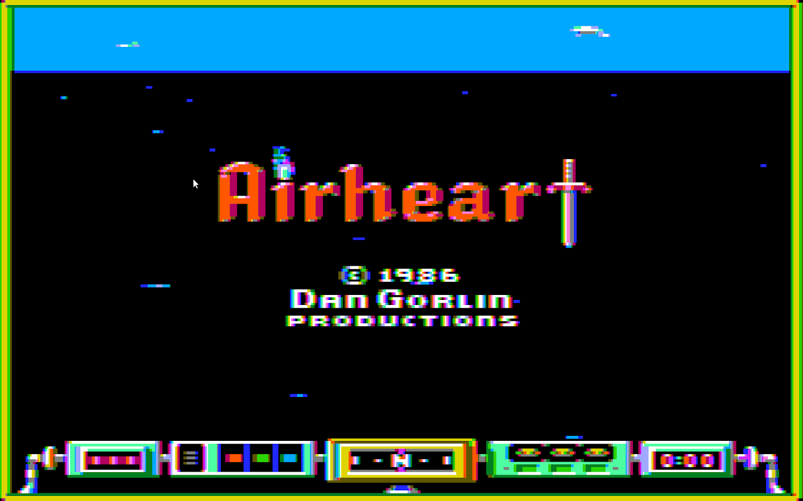
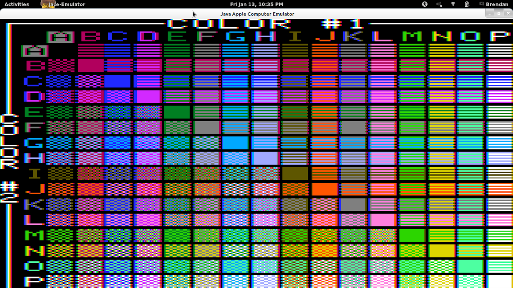
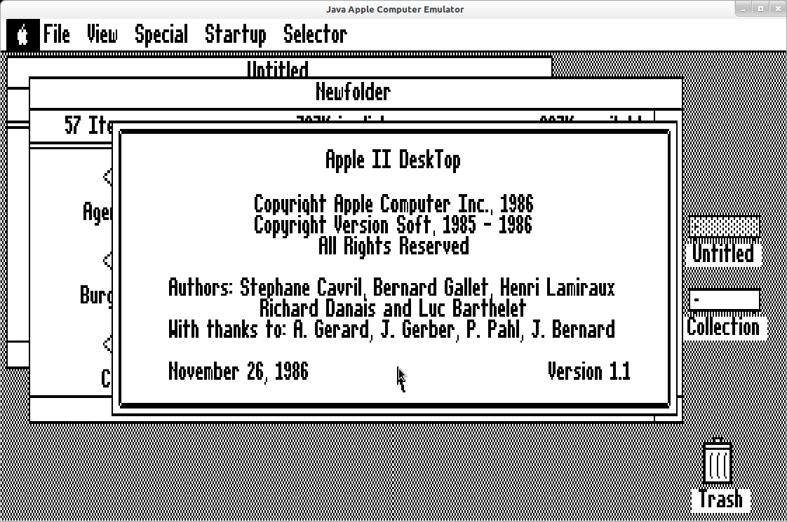

Java Apple Computer Emulator
====

Jace is a mature cycle-accurate emulation of an Apple //e computer.  The full library of software for that series is 100% compatible with this emulator, as well as many popular hardware add-ons such as:

- Joysticks (emulated by mouse or using real gamepads)
- Mouse
- Extended 80 Column card or Ramworks (Apple memory expansion compatible)
- Ramfactor
- Floppy drives (up to 14 supported)
- Hard drives (up to 12 supported) and 800kb disk images
- Mockingboard/Applied engineering Phasor (up to 6 supported)
- Passport MIDI Interface
- Super Serial Card (over TCP/IP emulation)
- Transwarp / Zip Chip
- Thunderclock / NoSlot Clock
- Apple RGB graphics modes

Other features of Jace include:

- Small IDE for programming Applesoft basic and Assembly (via built-in ACME cross assembler)
- Cheat features for some popular games like Prince of Persia, Montezuma's Revenge, Wolfenstein and more
- Metacheat feature allows searching memory for discovering new game cheats/mods

## Download:

* [See releases page for most recent](https://github.com/badvision/jace/releases)

## To Run:

* The easiest way to run Jace is by downloading a native build from gitub (see releases link above)

Running the standard java version of Jace requires you have installed Java 17 or later.
* If you are building from source you can use any of the following:
    - mvn javafx:run
    - mvn gluonfx:run (Note: gluonfx plugin currently only supports up to Maven 3.8.8)

## To Build natively:

In order to build Jace as a native application you need to install the following:
- Gluon's fork of GraalVM: https://github.com/gluonhq/graal/releases
- Compiler (XCode for Mac, GCC for Linux, Visual Studio for Windows)
- Maven 3.8.8 (not a newer version, unfortunately)

The Gluon instructions have more details about where to find and download these components.  Once you have them installed you can test the Java version via `mvn gluonfx:run` and if that is working correctly, then you can use `mvn gluonfx:build` to create a native binary in the target/gluonfx folder for your local platform.  Gluon is only able to build for the OS you are running it on, so building for multiple platforms requires separate windows, mac and linux machines.

The Gluon documentation provides a compatibility matrix for each OS platform and the prerequisites needed to create native applications on each.  See here for more details: https://docs.gluonhq.com/#_platforms

All other native dependencies are automatically downloaded as needed by Maven for the various LWJGL libraries.

### First time build note:
Because Jace provides an annotation processor for compilation, there is a chicken-and-egg problem when building the first time.  Currently, this means the first time you compile, run `mvn install` twice.  You don't have to do this step again as long as Maven is able to find a previously build version of Jace to provide this annotation processor.  I tried to set up the profiles in the pom.xml so that it disables the annotation processor the first time you compile to avoid any issues.  If running in a CICD environment, keep in mind you will likely always need to run the "mvn install" step twice, but only if your goal is to build the entire application including the annotations (should not be needed for just running unit tests.)

## Support JACE:

JACE will always be free, but it does take considerable time to refine and add new features.  If you would like to show your support and encourage the author to keep maintaining this emulator, why not throw him some change to buy him a drink?  (The emulator was named for the Jack and Cokes consumed during its inception.)

Donate here to support Jace developement:

* <a href="bitcoin:1TmP94jrEtJNqz7wrCpViA6musGsiTXEq?amount=0.000721&label=Jace%20Donations">BTC address: 1TmP94jrEtJNqz7wrCpViA6musGsiTXEq</a>
* <a href="https://www.paypal.me/BrendanRobert">Paypal</a>

  

More information here: https://sites.google.com/site/brendanrobert/projects/java-apple-computer-emulator
