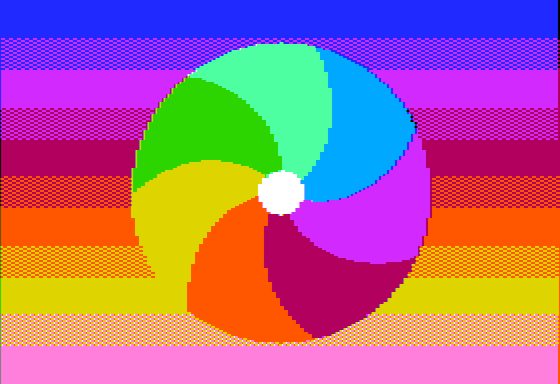

# DHGR Pinwheel over Sunset

A 6502 assembly program (ACME syntax) for the Apple II that draws a ROUND
7-blade curved pinwheel centered on the screen, over a vertical 6-band sunset
gradient (dark blue / purple / red / orange / yellow / pink) with a 16-row
checkerboard dither between each pair of bands, in Double-Hi-Res (DHGR) mode.

Verified against the JACE 65C02 emulator in this repo.



## What it shows

- A 6-band vertical sunset gradient (dark blue / purple / red / orange /
  yellow / pink) of the Apple II DHGR palette, with a 16-row checkerboard
  dither between each pair of bands so the transition is not a hard line.
- A round 7-sector pinwheel (curved, spiral blades, white hub) centered on the
  screen and drawn on top of the gradient. The pinwheel is computed in DISPLAY
  space so it is circular on the true 2:1-tall-pixel DHGR display.

## The 2:1 tall-pixel aspect (why "round" is subtle)

Apple II DHGR is 560x192 raw pixels but displays with **2:1 tall pixels**, so
the true display is **560x384**. A shape drawn with equal raw width and height
therefore looks like a 2:1 ellipse. This example computes the pinwheel in
display space -- column `c`, row `r` maps to display pixel `(4*c, 2*r)`, and the
pinwheel is the display-space circle `(4*(c-70))^2 + (2*(r-96))^2 <= R^2`. The
raw shape is thus 2x as wide as it is tall, which displays as a circle.

JACE's own `screenshot` scales the raw frame 2x on BOTH axes (1120x384), which
is 2x too wide. `dhgr-pinwheel.png` / `dhgr-pinwheel-shot.png` are rescaled to
the true **560x384** aspect (see the test script), which is what shows the
pinwheel as round.

## Files

- `generate.py` -- the Python source of truth for the two data tables. Rebuilds
  `dhgr-pinwheel.asm` (self-checks the DHGR packer, regenerates main/aux, writes a
  no-NTSC preview, assembles the .bin).
- `dhgr-pinwheel.asm` -- the full source (code + precomputed data tables).
  The source header explains the DHGR memory model, the 140x192 / 28-bit-word
  render grid, the 2:1 aspect correction, and the layout constraints.
- `dhgr-pinwheel.bin` -- the assembled binary (37888 bytes, $800-$9BFF).
- `dhgr-pinwheel-test.sh` -- one-shot build + JACE run + true-aspect screenshot.
- `dhgr-pinwheel.png` -- reference screenshot (true aspect 560x384).
- `dhgr-pinwheel-shot.png` -- latest test-script screenshot (true aspect 560x384).
- `dhgr-pinwheel-preview.png` -- no-NTSC color-accurate reference (true aspect 560x384).

## How to build and run

From the `jace/` repo root:

```
./examples/dhgr-pinwheel/dhgr-pinwheel-test.sh
```

This assembles with ACME, strips the Apple II header, loads the binary into
JACE at $800, runs it, and saves a true-aspect (560x384) screenshot.

## Regenerating the image

The two 7680-byte data tables in `dhgr-pinwheel.asm` are generated by `generate.py` from a
140x192 grid of palette indices. To change the picture (sunset bands, dither rows, pinwheel
colors/size/twist, hub, ...), edit the constants at the top of `generate.py` and re-run:

```
python3 examples/dhgr-pinwheel/generate.py --assemble
```

This re-checks the packer against the verified byte table in `docs/jace/advanced-assembly.md`
section 3d (plus a non-uniform round trip), rewrites `dhgr-pinwheel.asm` in place (leaving the
6502 code section untouched), and rebuilds `dhgr-pinwheel.bin`. `--preview out.png` writes a
no-NTSC, true-aspect reference image for checking exact colors and geometry.

## Key DHGR lessons baked in

1. **Pack the 28-bit word LSB-first.** For a column-pair, the 7 cells (7k..7k+6)
   go into nibbles at bits 0-3, 4-7, ..., 24-27 (cell 7k is the lowest nibble),
   then b1=bits 0-6, b2=bits 7-13, b3=bits 14-20, b4=bits 21-27 map to aux[x],
   main[x], aux[x+1], main[x+1]. **Solid-color self-tests hide packing bugs**
   (all four bytes are identical, so a reversed nibble order or byte extraction
   still renders a solid color). Always verify the packer against the verified
   byte table in `docs/jace/advanced-assembly.md` section 3d *and* on a
   non-uniform row.
2. **The 140x192 cell grid is a simplification.** Each 28-bit word is 7 nibbles x
   4 px = 28 px; 20 words/row x 28 = 560 px. Staying on this 4-px grid keeps layout
   simple and maps cleanly to other platforms' pixels for porting; any detail can be
   drawn at full 140x192 resolution, not just coarse solid blocks. Real DHGR is
   per-pixel (560 independent 4-bit colors/row, defined in YIQ / the NTSC color
   clock) -- the constant-nibble cell grid is its special case. See section 3d.
3. **2:1 tall pixels.** Circles must be drawn in display space (y scaled by 2),
   otherwise they look like 2:1 ellipses.
4. **Data must not overlap video RAM.** Code at $800; the two 7680-byte row
   tables live at $6000 (main) and $7E00 (aux), in plain RAM. $2000-$5FFF is
   DHGR video and must never hold program data.
5. **Two-pass row copy** with a single PAGE2 toggle per pass (main pass with
   PAGE2 off, aux pass with PAGE2 on) -- far faster than toggling per byte.
6. **Re-point the destination before the aux pass** -- the copy routine
   advances the destination pointer, so reusing it writes the aux row one DRAM
   row too far (a subtle bug that silently misaligns even/odd pixel columns).
7. **Page-safe copy** -- `(zp),Y`/`(abs),Y` do not carry across a $100 page
   boundary, so the copy splits at boundaries and bumps the high byte by hand.
8. **DRAM rows are non-linear.** Row address =
   `$2000 + ((y>>3)&7)*128 + 40*(y>>6) + (y&7)*1024`.

See `docs/jace/advanced-assembly.md` (section 3d) for the full DHGR reference.
